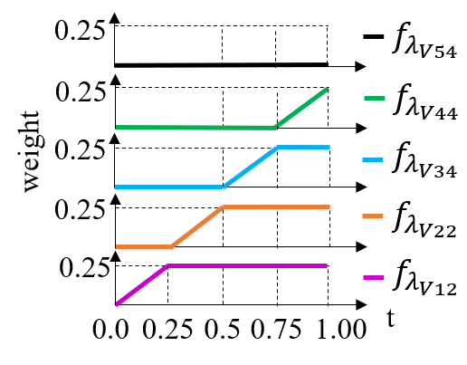

# SROT
## (ESRGAN-SROT-M1234-v2-4x)

### Training
To train an ESRGAN-SROT model:

    python train.py -opt options/train/train.yml

- Before running this code, download the pretrained RRDB SR 4x model <a href="https://www.dropbox.com/s/m0ejc0qhqi9l1rq/RRDB_PSNR_x4.pth?dl=0">Link</a>. This pretrained RRDB_PSNR_4x.pth is provided by the ESRGAN author <a href="https://github.com/xinntao/ESRGAN">Link</a>.
- The defalut objective trajectory in the training code is below as in the our CVPR paper <a href="https://openaccess.thecvf.com/content/CVPR2023/html/Park_Perception-Oriented_Single_Image_Super-Resolution_Using_Optimal_Objective_Estimation_CVPR_2023_paper.html">Link</a>

