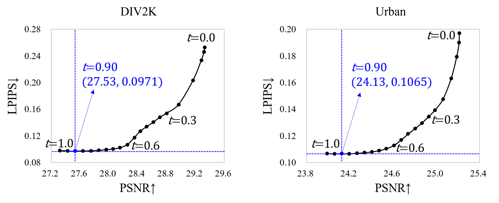
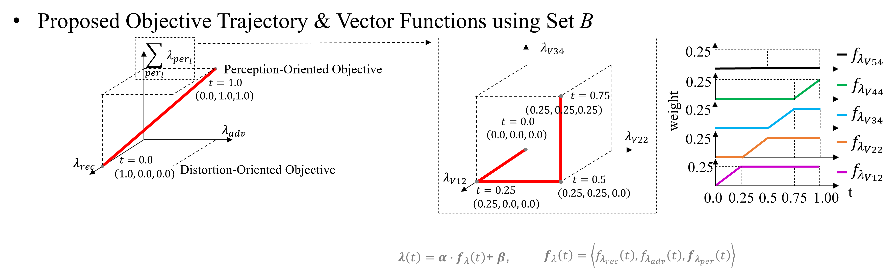

# SROT 

## Perception-Oriented Single Image Super-Resolution using Optimal Objective Estimation (CVPR 2023) <a href="https://openaccess.thecvf.com/content/CVPR2023/html/Park_Perception-Oriented_Single_Image_Super-Resolution_Using_Optimal_Objective_Estimation_CVPR_2023_paper.html">Link</a>

Seung Ho Park, Young Su Moon, Nam Ik Cho

## ESRGAN-SROT-M1234-v2-4x

- The objective trajectory of the training code is as in our CVPR paper <a href="https://openaccess.thecvf.com/content/CVPR2023/html/Park_Perception-Oriented_Single_Image_Super-Resolution_Using_Optimal_Objective_Estimation_CVPR_2023_paper.html">Link</a>

- Changes in the SROT results according to t values

## SROT (the generative SR model) Training

## Usage:

### Environments
- Pytorch 1.10.0
- CUDA 11.3
- Python 3.8
- 
### Test
To test pretrained ESRGAN-SROT model:

    python test.py -opt options/test/test.yml

- Before running this code, download the pretrained ESRGAN SROT 4x model <a href="https://www.dropbox.com/s/qy9na2i2o06rwf5/ESRGAN-SROT-M1234-v2-4x.pth?dl=0">Link</a>.
- Set the path of dataroot_LQ and pretrain_model_G in the yml file.

 You can also test pretrained ESRGAN-SROT model with different t values as follows:

    python test.py -opt options/test/test.yml -t 1.0
    python test.py -opt options/test/test.yml -t 0.0
    python test.py -opt options/test/test.yml -t 0.3
    
### Training
To train an ESRGAN-SROT model:

    python train.py -opt options/train/train.yml

- Before running this code, download the pretrained RRDB SR 4x model <a href="https://www.dropbox.com/s/m0ejc0qhqi9l1rq/RRDB_PSNR_x4.pth?dl=0">Link</a>. This pretrained RRDB_PSNR_4x.pth is provided by the ESRGAN author <a href="https://github.com/xinntao/ESRGAN">Link</a>.
- Set the path of dataroot_GT, dataroot_LQ and pretrain_model_G in the yml file.
- preparing training DB (The example of uising DIV2K dataset)

extract_subimgs_single.py -i path_to\DIV2K_train_HR\ -o path_to\DIV2K_train_HR_sub_480 -crop_sz 480 -step 240
extract_subimgs_single.py -i path_to\DIV2K_train_LR_bicubic\X4 -o path_to\DIV2K_train_LR_bicubic\X4_sub_120 -crop_sz 120 -step 60

In this case, related to train.yml, dataroot_LQ is path_to\DIV2K_train_LR_bicubic\X4_sub_120 and dataroot_GT is path_to\DIV2K_train_HR_sub_480.

## Citation

    @InProceedings{Park_2023_CVPR,
        author    = {Park, Seung Ho and Moon, Young Su and Cho, Nam Ik},
        title     = {Perception-Oriented Single Image Super-Resolution Using Optimal Objective Estimation},
        booktitle = {Proceedings of the IEEE/CVF Conference on Computer Vision and Pattern Recognition (CVPR)},
        month     = {June},
        year      = {2023},
        pages     = {1725-1735}
    }
    

## Acknowledgement
Our work and implementations are inspired by and based on BasicSR <a href="https://github.com/xinntao/BasicSR">[site]</a> 

