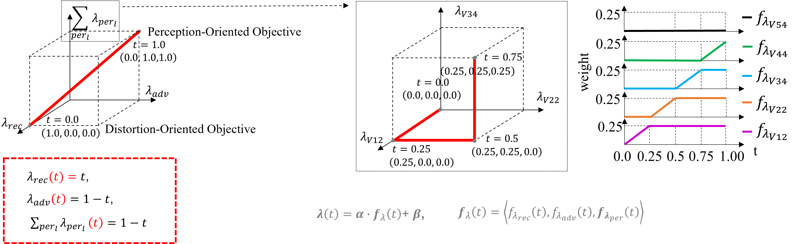

# SROT
## ESRGAN-SROT-M1234-v2-4x
### Paper: Perception-Oriented Single Image Super-Resolution using Optimal Objective Estimation (CVPR 2023) <a href="https://openaccess.thecvf.com/content/CVPR2023/html/Park_Perception-Oriented_Single_Image_Super-Resolution_Using_Optimal_Objective_Estimation_CVPR_2023_paper.html">Link</a>

Seung Ho Park, Young Su Moon, Nam Ik Cho

### Test
To test pretrained ESRGAN-SROT model:

    python test.py -opt options/test/test.yml

- Before running this code, download the pretrained ESRGAN SROT 4x model <a href="https://www.dropbox.com/s/qy9na2i2o06rwf5/ESRGAN-SROT-M1234-v2-4x.pth?dl=0">Link</a>.

### Training
To train an ESRGAN-SROT model:

    python train.py -opt options/train/train.yml

- Before running this code, download the pretrained RRDB SR 4x model <a href="https://www.dropbox.com/s/m0ejc0qhqi9l1rq/RRDB_PSNR_x4.pth?dl=0">Link</a>. This pretrained RRDB_PSNR_4x.pth is provided by the ESRGAN author <a href="https://github.com/xinntao/ESRGAN">Link</a>.
- The objective trajectory of the training code is as in our CVPR paper <a href="https://openaccess.thecvf.com/content/CVPR2023/html/Park_Perception-Oriented_Single_Image_Super-Resolution_Using_Optimal_Objective_Estimation_CVPR_2023_paper.html">Link</a>

## Citation

    @InProceedings{Park_2023_CVPR,
        author    = {Park, Seung Ho and Moon, Young Su and Cho, Nam Ik},
        title     = {Perception-Oriented Single Image Super-Resolution Using Optimal Objective Estimation},
        booktitle = {Proceedings of the IEEE/CVF Conference on Computer Vision and Pattern Recognition (CVPR)},
        month     = {June},
        year      = {2023},
        pages     = {1725-1735}
    }
    

## Acknowledgement
Our work and implementations are inspired by and based on BasicSR <a href="https://github.com/xinntao/BasicSR">[site]</a> 

